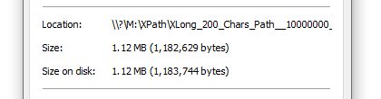
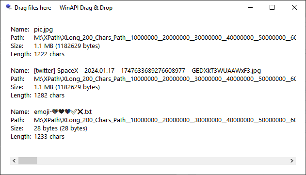
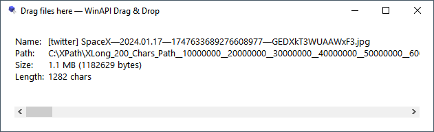
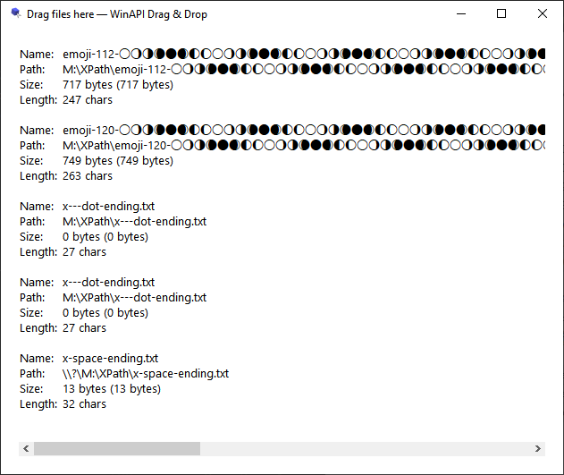
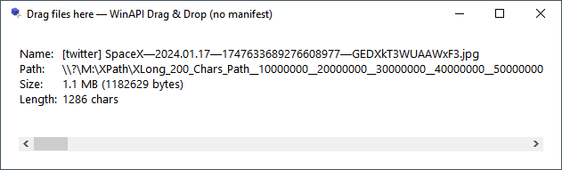
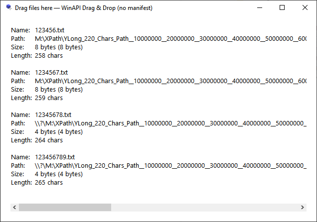
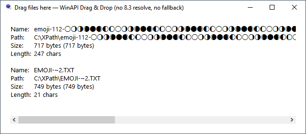
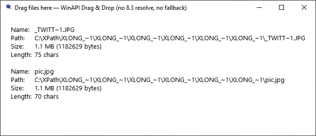

# [WinAPI Drag & Drop Application with Long Paths Support](https://github.com/AlttiRi/long-path-files-drag-and-drop)

A long filepath is a filepath with more than 259 characters (260 and more).

Most Windows applications, currently, do not support dropping of files with a long path. Currently. I hope. 

This article shows how to implement a long paths support for drag-n-drops.

---

## TL;DR
- add manifest with `longPathAware` property to work with long path without `\\?\` prefix,
- in `IDropTarget::Drop` method use `GetData` from `"Shell IDList Array"` format.

---

## The old approach

Just to note, the most old approach for file drop support is to call `DragAcceptFiles` in `WinMain`
and listen inside `WindowProc` function for `WM_DROPFILES` messages,
but it does not support a lot of things, in particular, it does not support long paths, 
the window just does not register long path file drops at all.

## The modern approach

**The modern approach** is to use `RegisterDragDrop` with custom `IDropTarget` class.

The `Drop` event is fired when you drop a file (or a folder) with a long path.
However, `IDataObject::GetData` will not return the data for 
[`CF_HDROP`](https://learn.microsoft.com/en-us/windows/win32/shell/clipboard#cf_hdrop) format when a drop contains a long path, 
you need to use
[`CFSTR_SHELLIDLIST` (`"Shell IDList Array"`)](https://learn.microsoft.com/en-us/windows/win32/shell/clipboard#cfstr_shellidlist) format 
(`RegisterClipboardFormatW(CFSTR_SHELLIDLIST)`) as a fallback, **it supports long paths**.

Here is a function _(use it in the `IDropTarget::Drop` method)_ to get the list of dropped files' paths:
```c++
    static std::vector<std::wstring> m_CollectDroppedFiles(IDataObject* pDataObject) {
        std::vector<std::wstring> files;

        FORMATETC feHDrop = {   CF_HDROP,       nullptr, DVASPECT_CONTENT, -1, TYMED_HGLOBAL };
        FORMATETC feSHIDL = { m_CF_SHELLIDLIST, nullptr, DVASPECT_CONTENT, -1, TYMED_HGLOBAL };
        STGMEDIUM stg;

        // Primary (for standard paths): CF_HDROP
        if (SUCCEEDED(pDataObject->GetData(&feHDrop, &stg))) {
            HDROP hDrop = (HDROP)GlobalLock(stg.hGlobal);
            if (hDrop) {
                UINT count = DragQueryFileW(hDrop, 0xFFFFFFFF, nullptr, 0);
                files.reserve(count);
                for (UINT i = 0; i < count; ++i) {
                    WCHAR szPath[MAX_PATH] = {};  // 259 (the max short path string length) + 1 (`\0` char)
                    if (DragQueryFileW(hDrop, i, szPath, MAX_PATH)) {
                        files.emplace_back(m_ResolveToLongPath(szPath));
                    }
                }
                GlobalUnlock(stg.hGlobal);
            }
            ReleaseStgMedium(&stg);
        } else
        // Fallback (for long paths): RegisterClipboardFormatW("Shell IDList Array")
        if (SUCCEEDED(pDataObject->GetData(&feSHIDL, &stg))) {
            LPIDA pIda = (LPIDA)GlobalLock(stg.hGlobal);
            if (pIda) {
                LPCITEMIDLIST pidlFolder = (LPCITEMIDLIST)((LPBYTE)pIda + pIda->aoffset[0]);
                for (UINT i = 1; i <= pIda->cidl; ++i) {
                    LPCITEMIDLIST pidlItem = (LPCITEMIDLIST)((LPBYTE)pIda + pIda->aoffset[i]);
                    LPITEMIDLIST pidlFull = ILCombine(pidlFolder, pidlItem);
                    if (pidlFull) {
                        std::wstring path = m_GetPathFromPIDL(pidlFull);
                        if (!path.empty()) {
                            files.emplace_back(std::move(path));
                        }
                        ILFree(pidlFull);
                    }
                }
                GlobalUnlock(stg.hGlobal);
            }
            ReleaseStgMedium(&stg);
        }
        return files;
    }
```

If `SUCCEEDED(pDataObject->GetData(&feHDrop, &stg))` was `true`, that it means that all dropped files were 
with a path length is less than `260` (`MAX_PATH`).

_A more detailed description of the code will follow the next chapter with the theory of Windows paths._

## Extra details about long paths

### 8.3 Short Paths

However, Windows File Explorer for files with long path **on disk `C:`** converts their paths to 8.3 short paths.
It happens 
and with drag and drops, 
and with selecting files with system file picker dialog,
and when you open a file from File Explorer with an associated program by double click
_(in this case Explorer passes the path as command line argument for the target program)_.
_It happens with files on disk `C:` only._

For example, an image on disk C: with the follow long path _(478 UTF-16 chars)_:
```c++
wstring fullFilePath =
    L"C:\\XPath"
    L"\\XLong_200_Chars_Path__10000000__20000000__30000000__40000000__50000000__60000000__70000000__80000000__90000000_100000000_110000000_120000000_130000000_140000000_150000000_160000000_170000000_____X200X"
    L"\\XLong_200_Chars_Path__10000000__20000000__30000000__40000000__50000000__60000000__70000000__80000000__90000000_100000000_110000000_120000000_130000000_140000000_150000000_160000000_170000000_____X200X"
    L"\\[twitter] SpaceX—2024.01.17—1747633689276608977—GEDXkT3WUAAWxF3.jpg";
cout << fullFilePath.size() << endl;  // 478
```

In File Explorer's file's properties the location is `C:\XPath\XLONG_~1\XLONG_~1`:


If you open this file with an associated program from File Explorer,
Explorer also will pass the file's path as 8.3 path as a command line argument:
```
C:\XPath\XLONG_~1\XLONG_~1\_TWITT~1.JPG
```
So, you need manually convert the path with `GetLongPathNameW` WinAPI function for the correct representation.

### Verbatim prefix (`\\?\`) and "Long Path Aware" programs

For the same path, but on non-C disk (for example, on disk `M:`), File Explorer shows the file path with
**"verbatim" prefix** — `\\?\`:



When you open/select/drop such file from File Explorer, the file's path will be passed with `\\?\` prefix
if the target program is not `longPathAware`, and without the prefix if the program, receiving the file _(file's path)_,
is `longPathAware`.

### Device prefixes

There are two prefixed: device prefix `\\?\` and verbatim (device) prefix `\\?\`.

By using them you can not only access the file system on the mounted volumes,
but also access "kernel file (object) system" (NT Object Manager).

That kernel system contains the root `\`, directories and "files" _(they name them objects)_,
it's like it's in Unix where there are the root `/`, directories and everything is a "file".

### `\GLOBAL??`, `\\.\`, `\\?\`

When you use `\\?\`/`\\.\` prefix you access the content of `\GLOBAL??`.

Some part of the content of `\GLOBAL??` is available without these prefixes: it's drive letters `C:`, `D:`, 
and some "devices" `NUL`, `CON`, `COM1`, ... _(it's why it's not recommended to create files with these names)_.

The other parts of the content of `\GLOBAL??` is available only with the device/verbatim prefix.


All content of `\GLOBAL??` are symlinks. Almost all of them are symlinks to devices in `\Device` directory,
for example:
- `\GLOBAL??\C:`  -> `\Device\HarddiskVolume4`
- `\GLOBAL??\BootPartition` -> `\Device\HarddiskVolume4`
- `\GLOBAL??\PhysicalDrive0` -> `\Device\Harddisk0\DR0`
- `\GLOBAL??\NUL` -> `\Device\Null`

So, `\\.\` prefix mostly is used to access devices, it's why it names "device prefix".

For example, you can read a hard drive content directly, ignoring the filesystems, with
open `CreateFileA` and read `ReadFile` functions with this `\\.\PhysicalDrive0` path.

The difference between `\\.\` and `\\?\` prefixes is that `\\?\` skips normalization and length check, so,
a path with `\\?\` prefix considered as a "verbatim"/"literal"/"final" path, it's why it names "verbatim prefix".

By using `\\?\` prefix you can access files with tailing ` `/`.` (space/dot) in the name, and bypass the 259 path length limit.
Paths with `\\?\` prefix must be absolute and normalized.

Usually, the Verbatim `\\?\` prefix is used to work with long paths, so someone names it as the "Extended-Length Prefix".

### Kernel paths

Also, `GLOBAL??` directory have the follow symlinks:
- `Global` -> `\GLOBAL??`
- `GLOBALROOT` -> ``

With `\\.\GLOBALROOT\` path you access the root `\` kernel directory. 
The root directory includes `DosDevices` symlink to `??` virtual directory, which, mostly, it's an alias for `GLOBAL??` directory.

Such way, all these paths are leads to the same file:

- `C:\XPath\pic.jpg` — a (common) file path
- `\\.\C:\XPath\pic.jpg` — a device file path
- `\\?\C:\XPath\pic.jpg` — a verbatim (device) file path
- `\\.\Global\C:\XPath\pic.jpg`
- `\\.\GLOBALROOT\DosDevices\C:\XPath\pic.jpg`
- `\\.\HarddiskVolume4\XPath\pic.jpg`
- `\\.\GLOBALROOT\Device\HarddiskVolume4\XPath\pic.jpg`
- `\\.\Global\GLOBALROOT\Device\HarddiskVolume4\XPath\pic.jpg`
- `\\.\GLOBALROOT\??\C:\XPath\pic.jpg`
- `\\.\GLOBALROOT\GLOBAL??\C:\XPath\pic.jpg`
- `\\?\GLOBALROOT\GLOBAL??\GLOBALROOT\??\C:\XPath\pic.jpg` _(a lot of `?`: `\\?\` + `GLOBAL??` + `??`)_
- `\\localhost\c$\XPath\pic.jpg` — a UNC file path
- `\\.\UNC\localhost\c$\XPath\pic.jpg` — a UNC device file path
- `\\.\UNC\127.0.0.1\c$\XPath\pic.jpg` _(`UNC` is a symlink in `GLOBAL??` directory to `\Device\Mup` device)_

Also, you can access the NT paths directly with special `Nt*` functions (for example, `NtCreateFile`):
- `\??\C:\XPath\pic.jpg`
- `\GLOBAL??\C:\XPath\pic.jpg`
- `\DosDevices\C:\XPath\pic.jpg`
- `\Device\HarddiskVolume4\XPath\pic.jpg`

Use `WinObj64.exe` to explore the NT Object Manager:
- [https://learn.microsoft.com/en-us/sysinternals/downloads/winobj](https://learn.microsoft.com/en-us/sysinternals/downloads/winobj)

Also, here is a good article about Windows paths: 
- [https://chrisdenton.github.io/omnipath/Overview.html](https://chrisdenton.github.io/omnipath/Overview.html)

Note, in MinGW-w64 linked with legacy MSVCRT there is a bug, that any path with `?` is unsupported 
in non-WinAPI functions, even `\\?\` prefix:
- [https://github.com/mingw-w64/mingw-w64/issues/139](https://github.com/mingw-w64/mingw-w64/issues/139)

Just use MinGW-w64 linked with the modern UCRT.

---

### How to work with long paths

Before, `\\?\` prefix was required to work with long paths.

Starting with Windows 10 version 1607 (released in 2016),
applications can natively handle long paths without `\\?\` prefix if the application is "long path aware".
It requires the
[`LongPathsEnabled`](https://learn.microsoft.com/en-us/windows/win32/fileio/maximum-file-path-limitation?tabs=registry#registry-setting-to-enable-long-paths)
registry value in `HKEY_LOCAL_MACHINE\SYSTEM\CurrentControlSet\Control\FileSystem` must exist and be set to `1`,
**and** the exe file must contain an application manifest with the
[`<longPathAware>true</longPathAware>`](https://learn.microsoft.com/en-us/windows/win32/sbscs/application-manifests#longPathAware)
element.

### Manifest

Here is an example of a manifest:
```xml
<?xml version="1.0" encoding="UTF-8" standalone="yes"?>
<assembly xmlns="urn:schemas-microsoft-com:asm.v1" manifestVersion="1.0">
    <application xmlns="urn:schemas-microsoft-com:asm.v3">
        <windowsSettings>
            <longPathAware xmlns="http://schemas.microsoft.com/SMI/2016/WindowsSettings">true</longPathAware>
        </windowsSettings>
    </application>
</assembly>
```

Include this manifest in your .exe file, or just locate it near the result .exe file. 
In the second case the manifest must have the same name as the .exe file, for example — `DragDropApp.exe.manifest`. 
Keep in mind, that Windows may ignore the external manifest due to caching, you need to either update .exe file's mtime,
or simply rename both files.

To update mtime here is a powershell script, which you can also put into a `.bat` file:
```ps
powershell -NoProfile -Command "(Get-Item 'DragDropApp.exe').LastWriteTime = Get-Date"
```

### `LongPathsEnabled` Registry value

`LongPathsEnabled` can be enabled manually in Registry Editor (`regedit.exe`) at
```
Computer\HKEY_LOCAL_MACHINE\SYSTEM\CurrentControlSet\Control\FileSystem
```


or with PowerShell script:
```powershell
New-ItemProperty -Path "HKLM:\SYSTEM\CurrentControlSet\Control\FileSystem" -Name "LongPathsEnabled" -Value 1 -PropertyType DWORD -Force
```

Changing the registry key applies instantly, you only need to restart the program if it was running.

### `IsLongPathAwareEnabled` program check

To check is your program "long path aware", you can use this computed constant:
```c++
static const bool IsLongPathAwareEnabled = []() -> bool {
    const auto proc = GetProcAddress(GetModuleHandleW(L"ntdll.dll"), "RtlAreLongPathsEnabled");
    const auto addr = reinterpret_cast<uintptr_t>(proc);
    return addr && reinterpret_cast<BOOLEAN(*)()>(addr)();
}();
```

It can be used for things like this:

```c++
cout << (IsLongPathAwareEnabled ? "LongPathAware is enabled" : "LongPathAware is disabled") << endl;

if (IsLongPathAwareEnabled) {
    printFileSize(fullFilePath);               // OK
} else {
    printFileSize(L"\\\\?\\" + fullFilePath);  // OK
    printFileSize(fullFilePath);               // "File does not exist."
}
```

`printFileSize` here is just a function works with the filesystem:
```c++
static void printFileSize(const wstring& filePath) {
    if (filesystem::exists(filePath)) {
        cout << "File size: " << filesystem::file_size(filePath) << " bytes" << endl;
    } else {
        cout << "File does not exist." << endl;
    }
} 
```

### `IsLongPathAwareEnabled` full example

Here is the full example:
```c++
#include <windows.h>
#include <filesystem>
#include <iostream>
#include <string>

using namespace std;

static const bool IsLongPathAwareEnabled = []() -> bool {
    const auto proc = GetProcAddress(GetModuleHandleW(L"ntdll.dll"), "RtlAreLongPathsEnabled");
    const auto addr = reinterpret_cast<uintptr_t>(proc);
    return addr && reinterpret_cast<BOOLEAN(*)()>(addr)();
}();

static void printFileSize(const wstring& filePath) {
    if (filesystem::exists(filePath)) {
        cout << "File size: " << filesystem::file_size(filePath) << " bytes" << endl;
    } else {
        cout << "File does not exist." << endl;
    }
}

int main() {
    wstring fullFilePath =
        L"C:\\XPath"
        L"\\XLong_200_Chars_Path__10000000__20000000__30000000__40000000__50000000__60000000__70000000__80000000__90000000_100000000_110000000_120000000_130000000_140000000_150000000_160000000_170000000_____X200X"
        L"\\XLong_200_Chars_Path__10000000__20000000__30000000__40000000__50000000__60000000__70000000__80000000__90000000_100000000_110000000_120000000_130000000_140000000_150000000_160000000_170000000_____X200X"
        L"\\[twitter] SpaceX—2024.01.17—1747633689276608977—GEDXkT3WUAAWxF3.jpg";
    cout << "Path length: " << fullFilePath.size() << endl;  // 478

    cout << (IsLongPathAwareEnabled ? "LongPathAware is enabled" : "LongPathAware is disabled") << endl;

    if (IsLongPathAwareEnabled) {
        printFileSize(fullFilePath);
    } else {
        printFileSize(L"\\\\?\\" + fullFilePath);
        printFileSize(fullFilePath); // "File does not exist."
    }
}
```

### Verbatim prefix extra details

`filesystem::file_size`, `_stat64`/`_wstat64`, `GetFileAttributesExW` — all of them require `\\?\` prefix if
the program is not `longPathAware` to work with long paths.

Remember, that `\\?\` not only is used to allow fs functions to work with long paths,
this prefix disables normalization ("path parsing").
The prefixed path must be absolute (not relative) and normalized.

For example: `C:\XPath\..\XPath/./pic.jpg`. It's a valid path, but it will not work with `\\?\` prefix,
because this path contains `/` as a separator, and the path is not normalized (includes `.`/`..`).
The correct verbatim prefixed form for this path is `\\?\C:\XPath\pic.jpg`.

Only `\\?\` the correct form of the verbatim prefix, any non-norm prefix form: `//?/`, `\\?/`, ... 
works the same way as the usual device prefix `\\.\`.


The only case when the verbatim prefix is mandatory (even in "long path aware" program) 
is to access files that end with `.` (dot), or ` ` (space):
- `\\?\C:\XPath\x---dot-ending.txt.`
- `\\?\C:\XPath\x-space-ending.txt `

> [!NOTE]
> Do **not** create such files, Windows works with them badly. 
> Always trim or replace the ending spaces and dots when you create a new file.

### Verbatim prefix resume

In short, the best is just to make you program "long path aware".
Use `\\?\` prefix only if it's necessary, and you know that you do.

### Wide strings

To work with paths on Windows is recommended to use wide strings `std::wstring` (UTF-16) with *`W` functions
(for example: prefer 
[`GetFileAttributesExW`](https://learn.microsoft.com/en-us/windows/win32/api/fileapi/nf-fileapi-getfileattributesexw) to 
[`GetFileAttributesExA`](https://learn.microsoft.com/en-us/windows/win32/api/fileapi/nf-fileapi-getfileattributesexa)).

In particular, to correctly compute limits: 
for example, this short path is less than `MAX_PATH` in UTF-16, but not in UTF-8 string:
```c++
                                            // 112 emojis — 224 utf-16 chars — 448 utf-8 bytes
wstring shortPathW = L"C:\\XPath\\emoji-112-🌕🌖🌗🌘🌑🌒🌓🌔🌕🌖🌗🌘🌑🌒🌓🌔🌕🌖🌗🌘🌑🌒🌓🌔🌕🌖🌗🌘🌑🌒🌓🌔🌕🌖🌗🌘🌑🌒🌓🌔🌕🌖🌗🌘🌑🌒🌓🌔🌕🌖🌗🌘🌑🌒🌓🌔🌕🌖🌗🌘🌑🌒🌓🌔🌕🌖🌗🌘🌑🌒🌓🌔🌕🌖🌗🌘🌑🌒🌓🌔🌕🌖🌗🌘🌑🌒🌓🌔🌕🌖🌗🌘🌑🌒🌓🌔🌕🌖🌗🌘🌑🌒🌓🌔🌕🌖🌗🌘🌑🌒🌓🌔.txt";
string  shortPathA =  "C:\\XPath\\emoji-112-🌕🌖🌗🌘🌑🌒🌓🌔🌕🌖🌗🌘🌑🌒🌓🌔🌕🌖🌗🌘🌑🌒🌓🌔🌕🌖🌗🌘🌑🌒🌓🌔🌕🌖🌗🌘🌑🌒🌓🌔🌕🌖🌗🌘🌑🌒🌓🌔🌕🌖🌗🌘🌑🌒🌓🌔🌕🌖🌗🌘🌑🌒🌓🌔🌕🌖🌗🌘🌑🌒🌓🌔🌕🌖🌗🌘🌑🌒🌓🌔🌕🌖🌗🌘🌑🌒🌓🌔🌕🌖🌗🌘🌑🌒🌓🌔🌕🌖🌗🌘🌑🌒🌓🌔🌕🌖🌗🌘🌑🌒🌓🌔.txt";

cout << shortPathW.size() << endl; // 247
cout << shortPathA.size() << endl; // 471
```

Also, [`SHGetPathFromIDListEx`](https://learn.microsoft.com/en-us/windows/win32/api/shlobj_core/nf-shlobj_core-shgetpathfromidlistex)
function works only with wide strings.

So, if you need to convert strings from UTF-16 to UTF-8 and back you can use the follow functions:
```c++
static std::string ConvertWideStringToUTF8(const std::wstring_view wstr) {
    if (wstr.empty()) return {};
    int size = WideCharToMultiByte(CP_UTF8, 0, wstr.data(), static_cast<int>(wstr.size()), nullptr, 0, nullptr, nullptr);
    std::string str(size, '\0');
    WideCharToMultiByte(CP_UTF8, 0, wstr.data(), static_cast<int>(wstr.size()), str.data(), size, nullptr, nullptr);
    return str;
}
static std::wstring ConvertUTF8ToWideString(const std::string_view str) {
    if (str.empty()) return {};
    int size = MultiByteToWideChar(CP_UTF8, 0, str.data(), static_cast<int>(str.size()), nullptr, 0);
    std::wstring wstr(size, L'\0');
    MultiByteToWideChar(CP_UTF8, 0, str.data(), static_cast<int>(str.size()), wstr.data(), size);
    return wstr;
}
```

## The drop code in details

When files are dropped into an application, the `Drop` callback is invoked:

```c++
HRESULT STDMETHODCALLTYPE Drop(IDataObject* pDataObject, DWORD, POINTL, DWORD* pdwEffect) override
{
    // ...

    std::vector<std::wstring> files = m_CollectDroppedFiles(pDataObject);
    m_HandleFilepaths(files);

    // ...
}
```

You need to parse the dropped files paths from `IDataObject` object.

To `GetData` from `pDataObject` you need to use `CF_HDROP` format if all dropped paths are short, 
either you need to use `RegisterClipboardFormatW(CFSTR_SHELLIDLIST)` format:
```c++
m_CF_SHELLIDLIST = RegisterClipboardFormatW(CFSTR_SHELLIDLIST);  // "Shell IDList Array"
```
to take paths if one or more of dropped paths are long.

```c++
static std::vector<std::wstring> m_CollectDroppedFiles(IDataObject* pDataObject) {
    std::vector<std::wstring> files;

    FORMATETC feHDrop = {   CF_HDROP,       nullptr, DVASPECT_CONTENT, -1, TYMED_HGLOBAL };
    FORMATETC feSHIDL = { m_CF_SHELLIDLIST, nullptr, DVASPECT_CONTENT, -1, TYMED_HGLOBAL };
    STGMEDIUM stg;

    if (SUCCEEDED(pDataObject->GetData(&feHDrop, &stg))) {
        // ...
    } else
    if (SUCCEEDED(pDataObject->GetData(&feSHIDL, &stg))) {
        // ...
    }
    return files;
}
```

### Primary drop handler (`CF_HDROP`)

Here is a pretty common code for taking the file paths from `IDataObject` object with `DragQueryFileW` function:
```c++
if (SUCCEEDED(pDataObject->GetData(&feHDrop, &stg))) {
    HDROP hDrop = (HDROP)GlobalLock(stg.hGlobal);
    if (hDrop) {
        UINT count = DragQueryFileW(hDrop, 0xFFFFFFFF, nullptr, 0);
        files.reserve(count);
        for (UINT i = 0; i < count; ++i) {
            WCHAR szPath[MAX_PATH] = {};  // 259 (the max short path string length) + 1 (`\0` char)
            if (DragQueryFileW(hDrop, i, szPath, MAX_PATH)) {
                files.emplace_back(m_ResolveToLongPath(szPath));
            }
        }
        GlobalUnlock(stg.hGlobal);
    }
    ReleaseStgMedium(&stg);
}
```

The only non-common detail here is `m_ResolveToLongPath` function.
This function fixes 8.3 paths, when you drop a long path from `C:` drive with `GetLongPathNameW` WinAPI function.

```c++
static std::wstring m_ResolveToLongPath(const std::wstring& path)
{
    if (path.empty()) {
        return path;
    }
    DWORD needed = GetLongPathNameW(path.c_str(), nullptr, 0);
    if (needed == path.size() + 1) { /* no changes */
        return path;
    }
    if (needed == 0) { /* error */
        return path.ends_with(L" ") ? L"\\\\?\\" + path : path;
    }
    std::wstring result(needed, L'\0'); /* else: resolve 8.3 path */
    GetLongPathNameW(path.c_str(), result.data(), needed);
    result.resize(needed - 1);
    return (IsLongPathAwareEnabled || result.size() < MAX_PATH /* 260 */) ? result : L"\\\\?\\" + result;
}
```
When you drop a short path, but with a tailing space ` `:
- `M:\XPath\x-space-ending.txt `

`DragQueryFileW` returns it without `\\?\` prefix, but this prefix is mandatory for paths ending with ` `/`.`, 
so you need to add it manually, in other case any filesystem function will not be able to work with the illegal path.

There is a bug in Windows, that for dropped files with a tailing dot `.`:
- `M:\XPath\x---dot-ending.txt.`
- `M:\XPath\x---dot-ending.txt...`

`DragQueryFileW` returns the path without the tailing dot(s) `.`. I just ignore that rare case.

`GetLongPathNameW` function returns the path without `\\?\` prefix, so, if the application is not "long path aware", 
then you need to add the verbatim prefix, to make the path valid.

To check the program's "long path aware"-ness use the `IsLongPathAwareEnabled` computed constant:
```c++
static const bool IsLongPathAwareEnabled = []() -> bool {
    const auto proc = GetProcAddress(GetModuleHandleW(L"ntdll.dll"), "RtlAreLongPathsEnabled");
    const auto addr = reinterpret_cast<uintptr_t>(proc);
    return addr && reinterpret_cast<BOOLEAN(*)()>(addr)();
}();
```


### Fallback drop handler (`"Shell IDList Array"`)

If the previous drop handler is failed, that means that there is a long path in the drop.

In this case we use `RegisterClipboardFormatW("Shell IDList Array")` format to `GetData` from `IDataObject` object:
```c++
if (SUCCEEDED(pDataObject->GetData(&feSHIDL, &stg))) {
    LPIDA pIda = (LPIDA)GlobalLock(stg.hGlobal);
    if (pIda) {
        LPCITEMIDLIST pidlFolder = (LPCITEMIDLIST)((LPBYTE)pIda + pIda->aoffset[0]);
        for (UINT i = 1; i <= pIda->cidl; ++i) {
            LPCITEMIDLIST pidlItem = (LPCITEMIDLIST)((LPBYTE)pIda + pIda->aoffset[i]);
            LPITEMIDLIST pidlFull = ILCombine(pidlFolder, pidlItem);
            if (pidlFull) {
                if (std::wstring path = m_GetPathFromPIDL(pidlFull); !path.empty()) {
                    files.emplace_back(std::move(path));
                }
                ILFree(pidlFull);
            }
        }
        GlobalUnlock(stg.hGlobal);
    }
    ReleaseStgMedium(&stg);
}
```

Since a long path can be really long,
for the memory optimization I use the follow approach to get the path from `SHGetPathFromIDListEx`:

```c++
static std::wstring m_GetPathFromPIDL(LPCITEMIDLIST pidl)
{
    std::wstring result;
    for (DWORD bufferSize : { 512, 4096, 32768 }) {
        result.assign(bufferSize, L'\0');
        if (SHGetPathFromIDListEx(pidl, result.data(), bufferSize, GPFIDL_DEFAULT)) {
            result.resize(std::wcslen(result.data()));
            break;
        } else {
            result = {};
        }
    }
    if (result.ends_with(L" ") && !result.starts_with(L"\\\\?\\")) {
        result = L"\\\\?\\" + result;
    }
    return result;
}
```
`SHGetPathFromIDListEx` also returns for a short path with tailing space(s) ` ` a path without `\\?\` prefix,
so, I add the prefix manually.

---

** That's all you need to take the long file paths from a file drop. **

---

## Demo application

The full long path drag and drop application code see in `main.cpp` file.

Also, you can download the complied program and test it with long paths files.

### The example files

Click here to download the 7-zip archive with the example long path directory:

- [XPath.7z.zip](https://github.com/user-attachments/files/24119183/XPath.7z.zip)

Extract `XPath.7z` from .zip _(is needed to uploaded to GitHub)_,
then extract `XPath.7z` to the root of your hard drive (to `C:\XPath`, `D:\XPath` folders).

To create `x---dot-ending.txt.` and `x-space-ending.txt` in `XPath` folder use, for example, Node.js command from a terminal:

```bash
node -e "require('fs').writeFileSync('x---dot-ending.txt.', '=dot-dot-dot=')"
node -e "require('fs').writeFileSync('x-space-ending.txt ', '=space-space=')"
```

Then, you can test the files from the unpacked archive with this demonstration drag and drop application.

> [!NOTE]
> Remember, that files with long paths on system disk `C:` have 8.3 short paths when you interact with them
> from File Explorer,
> so, for the correct tests extract the archive into non-`C:` disk root too.


### Demo application review

There are follow files:
- `DragDropApp.exe`
- `DragDropApp_no-manifest.exe` — a version is without the manifest.
- `DragDropApp_no-8dot3-resolve_no-fallback.exe` — a version is without 8.3 path resolving (`m_ResolveToLongPath`)
and without the fallback to `"Shell IDList Array"` drop parsing.


#### DragDropApp.exe

It's how drag'n'drop application should be.

It's support long path drop fron non-`C:` drive:



Long path from `C:` drive have the correct form:



The verbatim prefix is added only when needed:



- `"\\?\M:\XPath\x-space-ending.txt "` — a path with a tailing space, `13` bytes.

The only thing which is not supported is paths with ending dots, because WinAPI removes them:

- `M:\XPath\x---dot-ending.txt.`
- `M:\XPath\x---dot-ending.txt...`

Both files are with `0` size in the screenshot, `GetFileAttributesExW` failed.


#### `DragDropApp2_no-manifest.exe`

It's the same program as `DragDropApp.exe`, but compiled without a manifest with `longPathAware` property.

The only difference is that long paths are with the verbatim prefix:





#### `DragDropApp3_no-8dot3-resolve_no-fallback.exe`

This program has deleted 8.3 resolving (`m_ResolveToLongPath`), does not fixe a tailing space paths,
and has no fallback to `RegisterClipboardFormatW(CFSTR_SHELLIDLIST)` (`"Shell IDList Array"`) format.

_So, this program works like most of the existing applications._

❌ It does not support long path drops from non-`C:` drive at all.

❌ Fot long path drops from `C:` drive it shows 8.3 file paths:





❌ Does not fix (short) file path with a tailing space:


